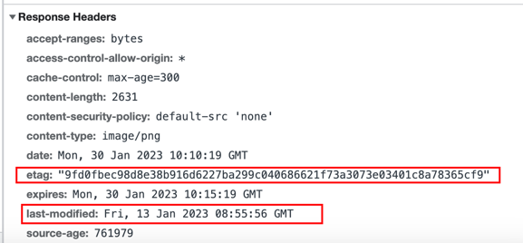

# http-study

### http的组成
#### http的请求
- 请求行
- 请求头
- 请求体（可以没有）

##### 请求行
- 请求方法 get/post...
- 请求的资源 
- 请求协议和版本
##### 请求头
请求头格式都为key:value
内容非常多，常见的：
- content-length 内容长度，如果缺少表示没有请求头
- content-type 请求类型，如果缺少post请求体无法被接收 ；application/x-www-form-urlencoded
- referer 来源网站 如果是通过别的网站跳转过来，就会带上referer。
##### 请求行
 

#### http的响应
- 响应行
- 响应头
- 响应体 （可以没有）
##### 响应行
- 协议
- 状态码 常见200 500 400 404等 
- 状态文字

状态码：
- 1xx：信息类型 接收到请求，继续处理 
- 2xx：成功 成功接收请求，并处理成功
- 3xx：重定向 未完成操作，将继续下一步操作 （304：内容没有改变，返回的是缓存）
- 4xx：客户端错误 请求有问题，或者无法满足请求内容
- 5xx：服务端错误 服务器出现错误

##### 响应头

- etag 缓存指纹 当请求图片等资源时，在第一次请求返回200和资源后，就会返回资源指纹，通过指纹的校验来决定后面是否采用缓存

### 缓存
http 可以通过设置请求头和响应头来控制缓存
#### 强缓存
强缓存不会向服务器发送请求，直接从缓存中读取资源，在 chrome 控制台的 network 选项中可以看到该请求返回 200 的状态码，
并且size显示from disk cache或from memory cache；

强缓存可以通过设置Expires和Cache-Control 两种响应头实现。如果同时存在，Cache-Control优先级高于Expires(Expires是http 1.0中，现在已经弃用)。

##### Cache-Control

>Cache-Control: max-age=315360000

Cache-Control 出现于 HTTP/1.1。可以通过指定多个指令来实现缓存机制。
**主要用表示资源缓存的最大有效时间**。
即在该时间端内，客户端不需要向服务器发送请求。
优先级高于 Expires。其过期时间指令的值是相对时间，它解决了绝对时间的带来的问题。

* public 表明响应可以被任何对象（包括：发送请求的客户端，代理服务器，等等）缓存。
* private 表明响应只能被单个用户缓存，不能作为共享缓存（即代理服务器不能缓存它）
* no-cache 不使用强缓存，需要与服务器验协商缓存验证。
* no-store 缓存不应存储有关客户端请求或服务器响应的任何内容，即不使用任何缓存。

#### 协商缓存
通过 Last-Modified/If-Modified-Since和ETag/If-None-Match这两对 Header 来控制。

##### Last-Modified、If-Modified-Since
Last-Modified与If-Modified-Since 的值都是 GMT 格式的时间字符串，代表的是文件的最后修改时间。

1. 在服务器在响应请求时，会通过Last-Modified告诉浏览器资源的最后修改时间。
2. 浏览器再次请求服务器的时候，请求头会包含Last-Modified字段，后面跟着在缓存中获得的最后修改时间。
3. 服务端收到此请求头发现有if-Modified-Since，则与被请求资源的最后修改时间进行对比，如果一致则返回 304 和响应报文头，浏览器只需要从缓存中获取信息即可。如果已经修改，那么开始传输响应一个整体，服务器返回：200 OK

但是在服务器上经常会出现这种情况，一个资源被修改了，但其实际内容根本没发生改变，会因为Last-Modified时间匹配不上而返回了整个实体给客户端（即使客户端缓存里有个一模一样的资源）。为了解决这个问题，HTTP/1.1 推出了Etag。Etag 优先级高与Last-Modified。
##### Etag、If-None-Match
Etag都是服务器为每份资源生成的唯一标识，就像一个指纹，资源变化都会导致 ETag 变化，跟最后修改时间没有关系，ETag可以保证每一个资源是唯一的。

1. 在浏览器发起请求，浏览器的请求报文头会包含 If-None-Match 字段，其值为上次返回的Etag发送给服务器
2. 服务器接收到次报文后发现 If-None-Match 则与被请求资源的唯一标识进行对比。
3. 如果相同说明资源没有修改，则响应返 304，浏览器直接从缓存中获取数据信息。如果不同则说明资源被改动过，则响应整个资源内容，返回状态码 200。

但是有特殊情况：

这种情况是无法访问
